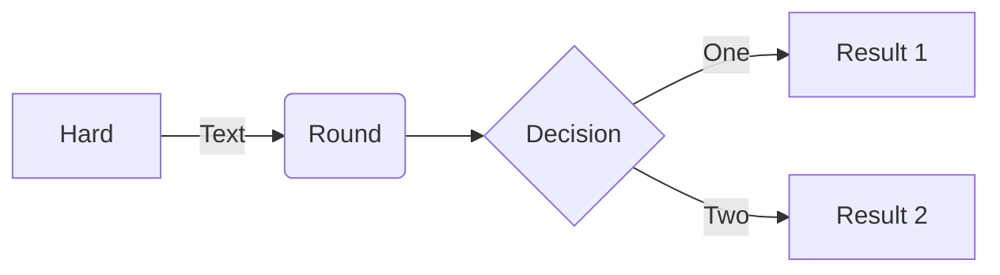

# The 5 Day Net

The 5 Day Net is a method of conducting a weekly net with a known group of participants without requiring a Net Control Station (NCS).

The Net runs Monday thru Friday, member will alternate between RX only days depending on whether they have a odd or even membership number.
The Net group size is limited to 20.

w6a 2 disable auto, @net hears b,c,d,e,f  
w6b 4 @net hears a,c,d,e,f  
w6c 1  
w6d 3  
w6e 6  
w6f 5  

* The Net lasts 5 days with a multi-hour time slot each day (1 hour minimum, but longer is better, 24x7 stations are the best)
* Use a simple microform (e.g. @NET MSG F!NET YG WX HAS BEEN COLD }ZZZ #FFFF)
* Use a group call (e.g @NET)
* Send your form as MSG to the group call
* Stage your form in the JS8Call Status field or use JS8Spotter
* The form is static and is used all week (5 days)
* Query Net member's forms by using STATUS? or use JS8Spotter query (e.g. @NET STATUS? and @NET E? F!NET)
* At the end of the week during the two non-Net days the forms received are reviewed
* The weekly microform will contain who was heard from the previous week
* The current exchange can support 20 Net members
* The Net members have to be pre-registered for the Net to report members heard
* Members commitment each week is:
  * run JS8call for at least 1 hour each day for 5 days
  * during the 1 hour period query the network for member forms
  * send your form to the Net
  * have your form available to be queried by the net members
  * have auto responses turn off for at least 30 minutes each day so you can receive other members forms

